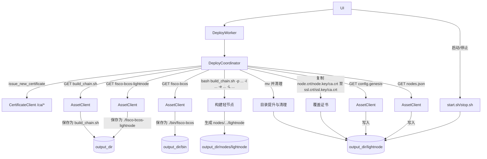

# workers/lightnode 重构计划（供审阅）

本计划聚焦将轻节点构建逻辑切换为“后端下发 build_chain.sh + 直接二进制下载 + 使用脚本构建 + start/stop 脚本管理”的新方案，并落地到 `workers/` 模块中（面向 `DeployCoordinator`/`DeployWorker` 与 UI）。

## 1. 业务逻辑

目标：
- 通过后端接口获取 `build_chain.sh`（字符串文本），落盘并赋予可执行权限。
- 直接下载二进制文件（不再是 tar.gz 解压；不区分 macOS 与 Linux，Windows 不支持）。
- 使用 `build_chain.sh` 构建轻节点；构建完成后将 `nodes/lightnode` 提升为与 `nodes/` 同级目录 `lightnode/`，并删除整个 `nodes/`。
- 用我们本地签发的 CA 证书覆盖 `lightnode/conf` 里的证书（写入 `ssl.key`/`ssl.crt` 和 `ca.crt`）。
- 从后端获取 `config.genesis` 与 `nodes.json` 覆盖 `lightnode/` 下对应文件。
- 使用 `lightnode/start.sh` 与 `lightnode/stop.sh` 管理节点生命周期，不再使用其他方式。

接口约定（与后端）：
- GET `{API_BASE}/lightnode/build_chain.sh` → 返回脚本文本（纯文本或 JSON 字符串包裹，需做换行/转义兼容）。
- GET `{API_BASE}/lightnode/executions/fisco-bcos` → 返回 `fisco-bcos` 二进制（application/octet-stream 或字符串直链，均需兼容）。
- GET `{API_BASE}/lightnode/executions/fisco-bcos-lightnode` → 返回 `fisco-bcos-lightnode` 二进制（同上）。
- GET `{API_BASE}/lightnode/genesis` → 返回 `config.genesis` 文本（纯文本或 JSON 字符串包裹，需兼容）。
- GET `{API_BASE}/lightnode/nodes` → 返回节点列表（List[str] 或 {"nodes": List[str]}）。
- 证书签发沿用现有 `/ca/*` 挑战-响应 + CSR 流程不变。

构建命令（在 `output_dir` 作为工作目录执行）：
```
bash build_chain.sh -p 30300,20200 -l 127.0.0.1:4 -e ./bin/fisco-bcos -L ./fisco-bcos-lightnode
```

产出与目录调整：
- 期望 `output_dir/nodes/lightnode` 生成。
- 将 `output_dir/nodes/lightnode` 移动为 `output_dir/lightnode`，再删除 `output_dir/nodes`。
- 覆盖 `output_dir/lightnode/conf` 中证书与 `config.genesis`、`nodes.json`。
- 之后通过 `output_dir/lightnode/start.sh` 与 `stop.sh` 管理服务。

与现状差异（主要变更点）：
- 删除/替换原“下载压缩包并解压二进制”的逻辑，改为“直接下载二进制”。
- 新增 `build_chain.sh` 下载与执行、目录重排与证书覆盖步骤。
- `config.ini` 不再强制从后端覆盖，保留脚本生成版本（后端若仍提供，可忽略）。

## 2. 数据流（mermaid）



## 3. 数据模型（pydantic）

新增建议（保持对 UI 兼容的前提下）：
- `DeploymentOptions`：封装部署参数，供 `DeployCoordinator.execute_deployment` 接收，默认值满足当前需求。
  - `output_dir: str`
  - `ports: str = "30300,20200"`
  - `lightnode_layout: str = "127.0.0.1:4"`（对应 `-l`）
  - `force_rebuild: bool = True`（可选：存在旧 `lightnode/` 时是否先清理）
  - `env: dict[str,str] | None = None`（可选：执行脚本时的额外环境变量）

- `DeploymentResult`：部署结果（若 UI 暂不需要，可保持 tuple 输出，内部转换即可）。
  - `success: bool`
  - `message: str`
  - `lightnode_dir: str | None`

现有 `NodeStatus` 维持不变，供 RPC 轮询使用。

## 4. 数据库模型

无数据库，暂不涉及。

## 5. TDD 的测试（pytest，根目录运行，绝对导入）

只测试公开接口；通过 monkeypatch/stub 替代外部依赖：

- 下载脚本与文本解码
  - `AssetClient.download_build_script(output_dir)`：
    - 正常：纯文本返回 / JSON 字符串包裹 / 带 `\n` 转义的文本，均能正确落盘并赋予 `+x`。
    - 错误：网络失败/权限异常，返回明确错误信息。

- 直接下载二进制
  - `AssetClient.download_binaries(output_dir)`：
    - 正常：`application/octet-stream` 或返回直链（再二次 GET）均能得到可执行文件；文件大小>0；`+x` 权限设置成功。
    - 错误：网络失败/内容为空/权限异常，能报错并不留下半成品。

- 构建与目录重排
  - `LightnodeBuilder.run_build(output_dir, options)`：
    - 使用测试专用的假 `build_chain.sh`（创建 `nodes/lightnode` 结构与占位文件），验证 `mv nodes/lightnode -> lightnode` 与删除 `nodes/`；重复构建时的覆盖行为（受 `force_rebuild` 控制）。

- 证书覆盖
  - `cert_utils.overlay_lightnode_certificates(src_conf, dst_conf)`：
    - 将 `node.key/node.crt/ca.crt` 复制为 `ssl.key/ssl.crt/ca.crt`（校验内容与权限）。
    - 错误：缺失文件时给出清晰错误。

- 覆盖链相关文件
  - `AssetClient.download_genesis(lightnode_dir)` 与 `AssetClient.download_nodes_json(lightnode_dir)`：
    - 正常：落盘且 JSON 结构符合期望（`{"nodes": [...]}`）。
    - 错误路径：格式不正确/网络失败。

- 集成流程
  - `DeployCoordinator.execute_deployment(...)`：
    - 全链路成功：返回 success，存在 `lightnode/`，文件齐全。
    - 失败分支：证书失败/脚本下载失败/构建失败/重排失败/覆盖失败/下载 genesis/nodes 失败，均能中断并返回错误。

测试注意：
- 使用 `tempfile.TemporaryDirectory()` 隔离文件系统副作用。
- 使用 `monkeypatch` 替换 `requests.get/post` 与 `subprocess.run`，避免真实网络与重命令执行。
- 日志打印覆盖关键路径，便于 DEBUG（符合“从公开接口获取内部错误内容”的要求）。

## 6. 模块结构与公开接口（计划）

- `asset_client.py`（项目根目录）
  - 新增：`download_build_script(output_dir)`、`download_binaries(output_dir)`、`download_nodes_json(output_dir)`。
  - 保留：`download_genesis(output_dir)`；`download_config(...)` 不再由部署流程调用（可保留兼容）。

- `cert_client.py`（项目根目录）
  - 保持：`issue_new_certificate(output_dir, node_id)`。

- `workers/cert_utils.py`
  - 新增：`overlay_lightnode_certificates(source_conf_dir, target_conf_dir)`。

- `workers/lightnode_builder.py`（新文件）
  - 职责：执行构建脚本、目录重排与清理（单一职责）。
  - 公开接口：
    - `run_build(output_dir, ports="30300,20200", layout="127.0.0.1:4") -> tuple[bool, str]`
    - `promote_and_cleanup(output_dir) -> tuple[bool, str]`（mv `nodes/lightnode` -> `lightnode` + 删除 `nodes/`）

- `workers/deploy_coordinator.py`
  - 改造 `execute_deployment(...)`：
    1) 证书签发（输出到 `output_dir/conf`）
    2) 下载 `build_chain.sh` 与两个二进制
    3) 构建（子进程执行脚本）
    4) 目录提升与清理
    5) 覆盖 `lightnode/conf` 证书
    6) 下载并覆盖 `config.genesis`、`nodes.json` 到 `lightnode/`
    7) 返回成功
  - 另提供：`start_lightnode(lightnode_dir)`、`stop_lightnode(lightnode_dir)`（可选新增，供 UI 调用）。

## 7. 用法示例（伪代码）

```python
# 假定 UI 已提供 api_url/output_dir/node_id
coordinator = DeployCoordinator(progress_callback=print)
ok, msg = coordinator.execute_deployment(api_url, output_dir, node_id)
if ok:
    # 启动
    coordinator.start_lightnode(os.path.join(output_dir, "lightnode"))
```

## 8. 设计说明（为何这样写）

- 将“下载脚本/二进制”、“执行构建/目录重排”、“证书/链文件覆盖”解耦为可单测的函数，遵循单一职责。
- 所有网络响应统一做“文本/JSON 字符串/直链”的兼容解析，降低后端实现差异的耦合度。
- 明确将 start/stop 作为唯一的生命周期管理入口，避免与其他方式冲突。

## 9. 风险与回退

- 构建脚本行为依赖后端版本，需在测试环境先行验证；若失败，保留旧目录不清理、返回可读错误。
- 二进制直链可能发生 302/鉴权，客户端做“内容与直链”双分支兼容，失败时打印响应摘要便于定位。
- 不支持 Windows；若检测到 `sys.platform == "win32"`，提前失败并给出明确说明。

## 10. 执行顺序

1) 新增 `lightnode_builder.py` 与 `cert_utils.overlay_lightnode_certificates`。
2) 扩展 `asset_client/`（脚本/二进制/节点列表下载）。
3) 改造 `deploy_coordinator.py` 的流程编排与日志。
4) 增加/调整 `workers/tests/` 用例，覆盖正常与错误路径。
5) 通过本地 pytest 验证后，再对接真实后端联调。


